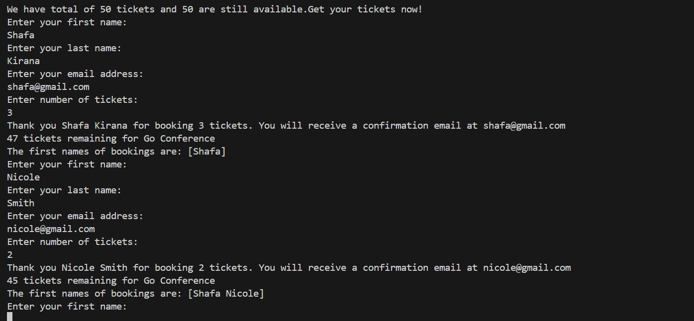
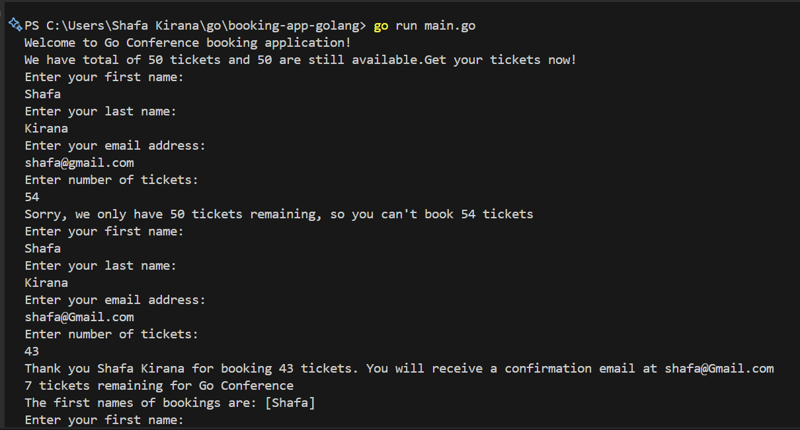
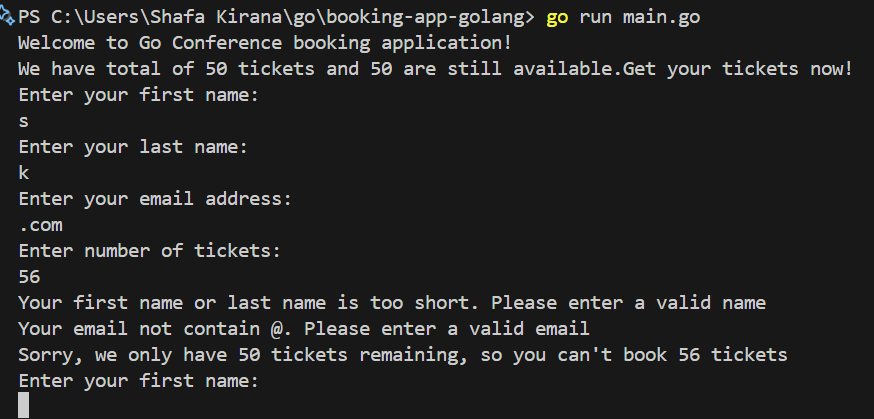
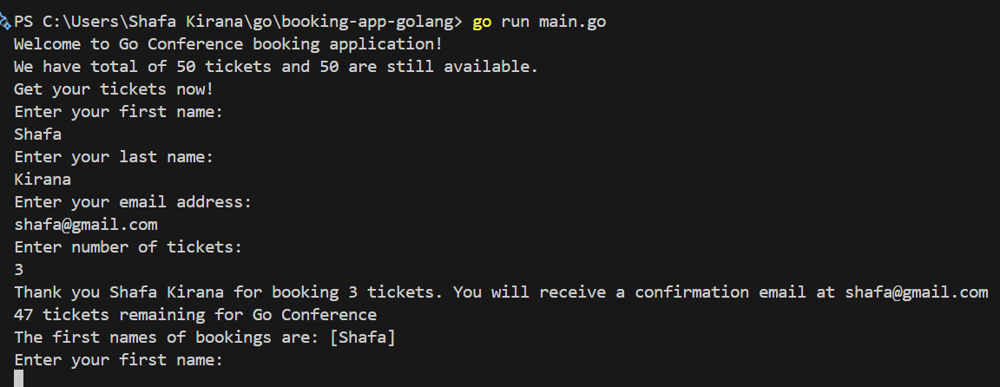
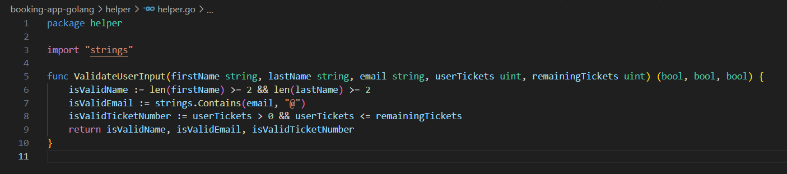
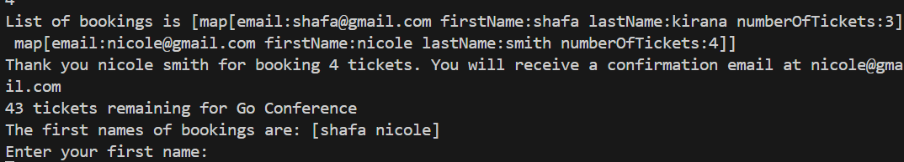
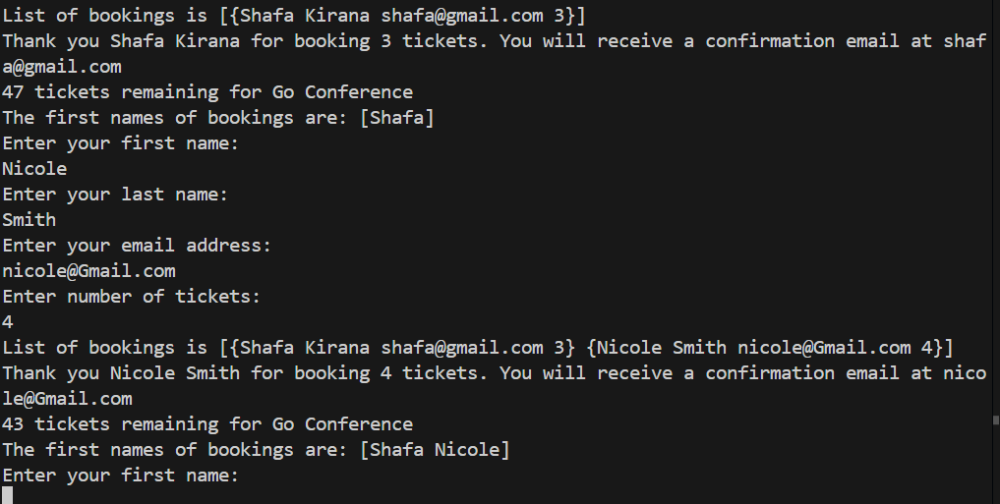
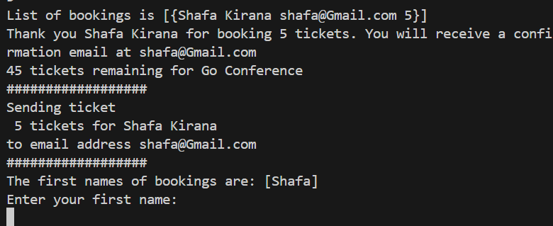
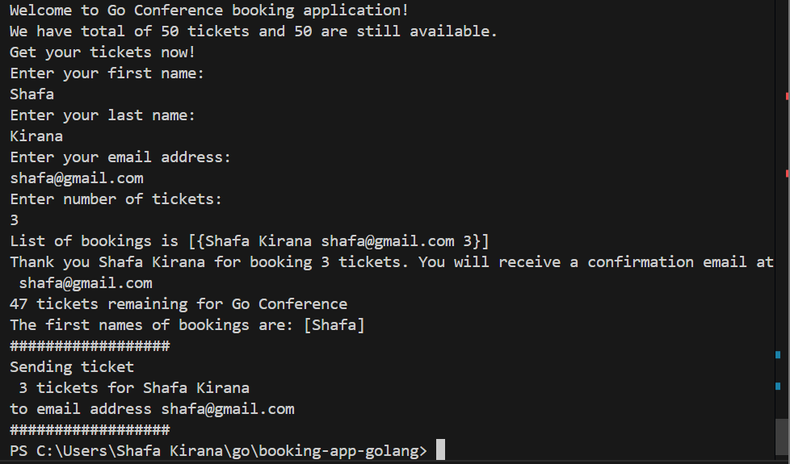

# Framework Programming IUP - Golang Project

Created by: Shafa Kirana Mulia - 5025221078

## Introduction to GO
Here are the core concepts that we will learn:

- Data Types
  - Strings, Integers and Booleans
  - Arrays and Slices
  - Maps
  - Structs

- Variables & Constants
- Formatted Output
- User Input
- Pointers
- Scope Rules
- If-else & Switch
- Functions
- Packages
- Goroutines

### Multi-Core Concurrency Support
- Go was designes to run on multiple cores and built to support concurrency
- Concurrency in Go is cheap and easy

### Characteristics of GO
- Server-Side or Backend Language: Microservices, Web Applications and Database Services

## Local Setup - Install Go & Editor
1. Go to https://go.dev/doc/install and download based on your operating system
2. Open in VSCode, create `main.go` and initialize `go mod init booking-app-golang`
3. All our code must belong to a package. You need to give Go entry point, the `main` function is the entrypoint of a Go program.

## Write our First Program & Structure of a Go File

```go
package main

import "fmt"

func main(){
  fmt.Print("Hello World")
}
```

### Go Packages
- Go programs are organized into packages
- Go's standard library, provides different core packages for us to use
- `fmt` is one of these, which you can use by importing it

## Variables & Constants in Go

```go
package main

import "fmt"

func main(){
  var conferenceName = "Go Conference"
  const conferenceTickets = 50
  
  fmt.Printf("Welcome to %v booking application!\n" conferenceName)
}
```

### Variables
- Variables are used to **store values**
- Like **containers** for values
- Give the variable a name and reference everywhere in the app

### Constants
- Like variables, except that their values **cannot be changed**

## Formatted Output - printf
### Print formatted data
```go
fmt.printf("Some text with a variable %s", myVariable)
```

- It takes a **template string** that contains the text that needs to be formatted 
- Plus some **annotation verbs (or placeholder)** that tells the `fmt` functions how to format the variable passed in

## Data Types in Go
### Strings
- For **textual data**, defined with double quotes
### Integers
- Representing **whole numbers**, positive and negative
- There are many more numeric data types (different integers type, different floating types, etc)

Basically, Go is a statically typed language. You need to tell Go Compiler, the data type when declaring the variabe. **Type inference**: But, actually Go can infer the type when you assign a value. When w don't assign the value immediately, we can type explicitly to make it more robust and help developers to catch type mismatches sooner. We can check the type of variables by using `%T` when printing, for example 

```go
fmt.Printf("conferenceTickets is %T, remainingTickets is %T, conferenceName is %T\n", conferenceTickets, remainingTickets, conferenceName)
```

## Getting User Input

### `fmt` Package
- Different functions for Formatted Input and Output (I/O) for example: print messages, collect user input and write into a file

## What is a Pointer?
- A pointer is a variable that **points to the memory address of another variable**. For example `&tickets`, `scan(&username)`

## Book Ticket Logic
At the beginning, we use `var userTickets int` data type, but the `remainingTickets` is using `uint`. Therefore, we need to change the `userTickets` to `uint` and add following lines for the logic, so that the remaining tickets can be reduced as customers enter their number of tickets.

```go
var userTickets uint
var remainingTickets uint = 50

remainingTickets = remainingTickets - userTickets
fmt.Printf("%v tickets remaining for %v\n", remainingTickets, conferenceName)
```

## Arrays & Slices
We want to store the entered user data in some kind of list. So, we need arrays and slices, which are a data structures to store collection of elements in a single variable. 

### Arrays
- Fixed sixe (size = how many elements the array can hold)
- Only the **same data type** can be stored

```go
// var variable_name [size]variable_type

var bookings = [50]string{}
bookings[0] = firstName + " " + lastName

	fmt.Printf("The whole array: %v\n", bookings)
	fmt.Printf("The first element: %v\n", bookings[0])
	fmt.Printf("Array type: %T\n", bookings)
	fmt.Printf("Array length: %v\n", len(bookings))
```

### Slices
We usually need a list that is more dynamic in size, where we don't need to specify a size at the beginning and automatically expands when new elements are added. 
- Slice is an abstraction of an array
- Slice are more flexible and powerful: **variable-length** or get an sub-array of its own
- Slice are also **index-based** and have a size, but is **resized when needed**

```go
var bookings = []string{}
bookings = append(bookings, firstName+" "+lastName)
fmt.Printf("The whole slice: %v\n", bookings)
fmt.Printf("The first element: %v\n", bookings[0])
fmt.Printf("Slice type: %T\n", bookings)
fmt.Printf("Slice length: %v\n", len(bookings))
```

### Append
- Here we can add the element(s) **at the end of the slice**.
- **Grows the slice if a greater capacity is needed** and returns the updated slice value. For example, `append(bookings)`

## Loops in Go
- In general, **languages provide various control structures** to control the applications flow
- A loop statement allows us to **execute code multiple times**, in a loop.
- Loops are simplified in Go. You only have the for loop `for` loop.

Result of an **Infinite Loop**, which directly goes to other user and ticket will reduce automatically.

<div align="center">
    
</div>

## For Each Loop
For each element in the list, we want to execute the same logic.

```go
firstNames := []string{}
		for _, booking := range bookings {
			var names = strings.Fields(booking)
			firstNames = append(firstNames, names[0])
		}

		fmt.Printf("The first names of bookings are: %v\n", firstNames)
```

Result:
<div align="center">
    
</div>

### `range`
- Range iterates over elements for different data structures (not only arrays and slices)
- For arrays and slices, range provides the index and values for each element

### `string.Fields()`
- Splits the string with white space as separator
- And returns a slice with the split elements, for example:
  - `"Nicole Smith"` is a string
  - `["Nicole", "Smith"]` is a slice

### Blank identifier
- To ignore a variable you don't want to use (_)
- So with Go you need to make unused variables explicit.

## Conditionals (if / else) and Boolean Data Type
The If/Else will be the main logic for making decisions in the app, whether to stopp app or continue.

```go
for {
		var firstName string
		var lastName string
		var email string
		var userTickets uint
		// ask user for their name
		fmt.Println("Enter your first name: ")
		fmt.Scan(&firstName)

		fmt.Println("Enter your last name: ")
		fmt.Scan(&lastName)

		fmt.Println("Enter your email address: ")
		fmt.Scan(&email)

		// fmt.Println(remainingTickets)
		// fmt.Println(&remainingTickets)

		fmt.Println("Enter number of tickets: ")
		fmt.Scan(&userTickets)

		// if userTickets > remainingTickets {
		// 	fmt.Printf("Sorry, we only have %v tickets remaining, so you can't book %v tickets\n", remainingTickets, userTickets)
		// 	continue
		// }

		if userTickets <= remainingTickets {
			remainingTickets = remainingTickets - userTickets
			//bookings[0] = firstName + " " + lastName
			bookings = append(bookings, firstName+" "+lastName)

			fmt.Printf("Thank you %v %v for booking %v tickets. You will receive a confirmation email at %v\n", firstName, lastName, userTickets, email)
			fmt.Printf("%v tickets remaining for %v\n", remainingTickets, conferenceName)

			firstNames := []string{}
			for _, booking := range bookings {
				var names = strings.Fields(booking)
				firstNames = append(firstNames, names[0])
			}

			fmt.Printf("The first names of bookings are: %v\n", firstNames)

			if remainingTickets == 0 {
				// end program
				fmt.Println("All tickets are sold out! Come back next year")
				break
			}
		} else {
			fmt.Printf("Sorry, we only have %v tickets remaining, so you can't book %v tickets\n", remainingTickets, userTickets)
		}
	}
```

Result:
<div align="center">
    
</div>

### `break` statement
- Terminates the for loop, and continues with the code right after the for loop 

### `continue` statement
- Causes loop to skip the remainder of its body
- And immediately retesting its condition (in our infinite loop our condition is always true)

### `if` vs `else if` vs `else`
- You can have unlimited `else if` statements
- But only 1 `if` statement and 1 `else` statement

### End of a loop
- A loop continues as long as a condition is true

## Validate User Input
We need to expect that and make sure our application can handle bad user input. We also set the `userTickets` validation because it needs to be entered correct number of tickets (positive + greater than 0).

```go
fmt.Println("Enter number of tickets: ")
		fmt.Scan(&userTickets)

		isValidName := len(firstName) >= 2 && len(lastName) >= 2
		isValidEmail := strings.Contains(email, "@")
		isValidTicketNumber := userTickets > 0 && userTickets <= remainingTickets

		if isValidName && isValidEmail && isValidTicketNumber {
			remainingTickets = remainingTickets - userTickets
			//bookings[0] = firstName + " " + lastName
			bookings = append(bookings, firstName+" "+lastName)

			fmt.Printf("Thank you %v %v for booking %v tickets. You will receive a confirmation email at %v\n", firstName, lastName, userTickets, email)
			fmt.Printf("%v tickets remaining for %v\n", remainingTickets, conferenceName)

			firstNames := []string{}
			for _, booking := range bookings {
				var names = strings.Fields(booking)
				firstNames = append(firstNames, names[0])
			}

			fmt.Printf("The first names of bookings are: %v\n", firstNames)

			if remainingTickets == 0 {
				// end program
				fmt.Println("All tickets are sold out! Come back next year")
				break
			}
		} else {
			if !isValidName {
				fmt.Println("Your first name or last name is too short. Please enter a valid name")
			}
			if !isValidEmail {
				fmt.Println("Your email not contain @. Please enter a valid email")
			}
			if !isValidTicketNumber {
				fmt.Printf("Sorry, we only have %v tickets remaining, so you can't book %v tickets\n", remainingTickets, userTickets)
			}
		}
```

Result if the input are wrong:
<div align="center">
    
</div>

### `len()`
- Built-in function returning length of variable, according to its type
- Arrays and Slices: Size of the list (number of elements)
- Strings: The number of characters

### Switch Statement
- Allows a variable to be tested for equality against a list of values
- Default handles the case, if no match is found

Code example:
```go
switch city{
	case "New York":
		//execute code for booking New York
	case "Singapore":
		//execute code for booking New York
	case "London":
		//execute code for booking New York
	case "Berlin":
		//execute code for booking New York
	case "Hong Kong":
		//execute code for booking New York
	default:
}
```

## Encapsulate Logic with Functions

Code example in the app:
```go
func greetUsers() {
	fmt.Printf("Welcome to %v booking application!\n", conferenceName)
	fmt.Printf("We have total of %v tickets and %v are still available.\n", conferenceTickets, remainingTickets)
	fmt.Println("Get your tickets now!")
}

func getFirstNames() []string {
	firstNames := []string{}
	for _, booking := range bookings {
		firstNames = append(firstNames, booking.firstName)
	}
	return firstNames
}

func validateUserInput(firstName string, lastName string, email string, userTickets uint) (bool, bool, bool) {
	isValidName := len(firstName) >= 2 && len(lastName) >= 2
	isValidEmail := strings.Contains(email, "@")
	isValidTicketNumber := userTickets > 0 && userTickets <= remainingTickets
	return isValidName, isValidEmail, isValidTicketNumber
}

func getUserInput() (string, string, string, uint) {
	var firstName string
	var lastName string
	var email string
	var userTickets uint
	// ask user for their name
	fmt.Println("Enter your first name: ")
	fmt.Scan(&firstName)

	fmt.Println("Enter your last name: ")
	fmt.Scan(&lastName)

	fmt.Println("Enter your email address: ")
	fmt.Scan(&email)

	fmt.Println("Enter number of tickets: ")
	fmt.Scan(&userTickets)

	return firstName, lastName, email, userTickets
}
```

Result is just the same as before:
<div align="center">
    
</div>

### Functions
- Functions will encapsulate code into own container (= function). Which logically belong together
- Like variable name, you should give a function a descriptive name
- Call the function by its name, whenever you want to execute this block of code
- So, a function is also used to reduce code duplication

### Parameters
- Information can be passed into functions as parameters
- Parameters are also called arguments

### Return Values
- A function can return data as a result
- So a function can take an input and return an output
- In Go, you have to define the input and output parameters including its type explicitly

### Package Level Variables
- Defined at the top outside all functions
- They can be accessed inside any of the functions
- And in all files, which are in the same package

### Local Variables
- Defined inside a function or a block
- They can be accessed only inside that function or block of code

## Organize Code with Go Packages
- Go programs are organized into packages
- A package is a collection of Go files

### Scope: Package Level
Here we create a new file named `helper.go` and move the `validateUserInput` there. Again: Variables and functions defined outside any function, can be accessed in all other files within the same package.

### Multiple Packages in your application
- This is to organize your app and logically group your code
- For exporting a variable, make it available for all packages in the app and capitilize first letter for example `ValidateUserInput`.

`helper.go`
Result is just the same as before:
<div align="center">
    
</div>

## Scope Rules in Go
There are 3 levels of scope in Go

### Local
- Declaration within function, which can be used only within that function
- Declaratin within block (e.g. for, if-else), which can be used only within that block

### Package
- Declaration outside all functions, which can be used everywhere in the same package

### Global
- Declaration outside all functions and uppercase first letter, which can be used everywhere across all packages

### Variable Scope
- Scope is the region of a program, where a defined variable can be accessed

## Maps
- Maps **unique keys to values**.
- You can retrieve the value by using its key later.
- However, we cannot mix data types by using maps

```go
Import strconv

var bookings = make([]map[string]string, 0)

func getFirstNames() []string {
	firstNames := []string{}
	for _, booking := range bookings {
		firstNames = append(firstNames, booking["firstName"])
	}
	return firstNames
}


func bookTicket(firstName string, lastName string, email string, userTickets uint) {
	remainingTickets = remainingTickets - userTickets
	//bookings[0] = firstName + " " + lastName

	//create a map for user
	var userData = make(map[string]string)
	userData["firstName"] = firstName
	userData["lastName"] = lastName
	userData["email"] = email
	userData["numberOfTickets"] = strconv.FormatUint(uint64(userTickets), 10)

	bookings = append(bookings, userData)
	fmt.Printf("List of bookings is %v\n", bookings)

	fmt.Printf("Thank you %v %v for booking %v tickets. You will receive a confirmation email at %v\n", firstName, lastName, userTickets, email)
	fmt.Printf("%v tickets remaining for %v\n", remainingTickets, conferenceName)
}
```

Result:
<div align="center">
    
</div>

## Creating a slice with `make`
- An alternative way to create slice
- We need to define the initial size of the slice

```go
var userData = make(map[string]string)
```

## Structs
- Stands for "Structure"
- Can hold mixed data types
- Can be mixed data type
- Defining a structure (which fields) of the User Type

```go
var bookings = make([]UserData, 0)

type UserData struct {
	firstName       string
	lastName        string
	email           string
	numberOfTickets uint
}

func getFirstNames() []string {
	firstNames := []string{}
	for _, booking := range bookings {
		firstNames = append(firstNames, booking.firstName)
	}
	return firstNames
}

func bookTicket(firstName string, lastName string, email string, userTickets uint) {
	remainingTickets = remainingTickets - userTickets
	//bookings[0] = firstName + " " + lastName

	//using struct
	var userData = UserData{
		firstName:       firstName,
		lastName:        lastName,
		email:           email,
		numberOfTickets: userTickets,
	}

	bookings = append(bookings, userData)
	fmt.Printf("List of bookings is %v\n", bookings)

	fmt.Printf("Thank you %v %v for booking %v tickets. You will receive a confirmation email at %v\n", firstName, lastName, userTickets, email)
	fmt.Printf("%v tickets remaining for %v\n", remainingTickets, conferenceName)
}
```

Result:
<div align="center">
    
</div>

### `type` statement - Custom Types
- The **type keyword creates a new type**, with the name you specify. E.g. *Create a type called `UserData` based on a struct of `firstName`, `lastName`..*
- In fact, you could also create a type based on every other data type like int, string, etc.

## Goroutines - Concurrency in Go

### `time` - functionality for time
- The `sleep` function stops or blocks the current thread (goroutine) execution for the defined duration -> `time.Sleep(10 * time.Second)`

Result:
<div align="center">
    
</div>

### Handle Blocking Code with Go Routines
Our current program execution is by default, a sequential code execution, which processing 1 task or 1 code after another. In go, **concurrency** can make our program more efficient. For now, a single thread execution is executed, which the `sendTickets` blocks the further processing for 10 second. And then, the code afterwards needs to wait until `sendTickets` finishes. 

We can executing `sendTicket` in a separate thread. So that executing the `sendTicket` code in this separate goroutine. As a result, the main thread doesn't wait for `sendTicket` to finish and next line of code is executed immediately.

```go
var wg = sync.WaitGroup{}

func main() {

	greetUsers()

	//fmt.Printf("conferenceTickets is %T, remainingTickets is %T, conferenceName is %T\n", conferenceTickets, remainingTickets, conferenceName)

	firstName, lastName, email, userTickets := getUserInput()

	isValidName, isValidEmail, isValidTicketNumber := helper.ValidateUserInput(firstName, lastName, email, userTickets, remainingTickets)

	if isValidName && isValidEmail && isValidTicketNumber {

		bookTicket(firstName, lastName, email, userTickets)

		wg.Add(1)
		go sendTicket(userTickets, firstName, lastName, email)

		firstNames := getFirstNames()
		fmt.Printf("The first names of bookings are: %v\n", firstNames)

		if remainingTickets == 0 {
			// end program
			fmt.Println("All tickets are sold out! Come back next year")
			//break
		}
	} else {
		if !isValidName {
			fmt.Println("Your first name or last name is too short. Please enter a valid name")
		}
		if !isValidEmail {
			fmt.Println("Your email not contain @. Please enter a valid email")
		}
		if !isValidTicketNumber {
			fmt.Printf("Sorry, we only have %v tickets remaining, so you can't book %v tickets\n", remainingTickets, userTickets)
		}
	}
	wg.Wait()
}


func sendTicket(userTickets uint, firstName string, lastName string, email string) {
	time.Sleep(40 * time.Second)
	var ticket = fmt.Sprintf("%v tickets for %v %v", userTickets, firstName, lastName)
	fmt.Println("##################")
	fmt.Printf("Sending ticket\n %v \nto email address %v\n", ticket, email)
	fmt.Println("##################")
	wg.Done()
}
```

Final Result:
<div align="center">
    
</div>


### `go` keyword
- `go ...` - starts a new goroutine
- A goroutine is a **lightweight thread** managed by the Go runtime, which make the code execution faster and stay responsive, since it will generates and sned ticket task run in the background.

### Syncronizing Go Routines
If we erase the for loop, it makes the sending tickets won't work. By default, the main goroutine doesn't wait for other goroutines. Main goroutine exited before `sendTicket` had time to start and execute the code. So, we need to tell `main` that it needs to wait until `sendTicket` is done.

#### Waitgroup
- Waits for the launched goroutine to finish
- Package `sync` provides basic synchronization functionality
- `Add`: Sets the number of goroutines to wait for (increases the counter by the provided number)
- `Wait`: Blocks utnil the WaitGroup counter is 0
- `Done`: Decrements the WaitGroup counter by 1. So, this is called by the goroutine to indicate that it's finished.

The tickets will be printed out before the application exist. The summary will be directly printed out, but we’re still waiting for the sending tickets and then after 40s it will be printed. So here the app actually waited for this separated thread to be done executing its logic and once the sending tickets was printed out, the app will exist.